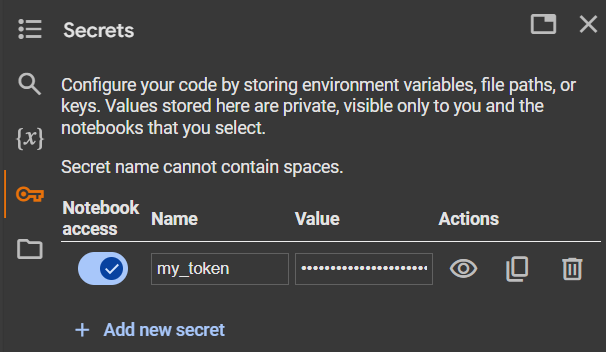

<div align="center">
  <h1>colab-utils</h1>
  <p>
    Convenience utilities for development workflows on Google Colab
  </p>

  <h4>
    <a href="https://readthedocs.org">Documentation</a>
  <span> · </span>
    <a href="https://github.com/dd-n-kk/colab-utils/issues/">Issues</a>
  </h4>
</div>


## About

- `colab-utils` is a small package that shares utility functions
  that I find useful for my development workflows on [Google Colab](https://colab.google).

- Actually, this is also a semi-mock project that I use to learn Python open-source development.
  [Feedbacks, guidance, and feature suggestions](https://github.com/dd-n-kk/colab-utils/issues/)
  are much appreciated!


## Usage

### Experiment your private package on Colab

1. Develop your package any way you like and push it to your private GitHub repo.

2. Make a repo-specific [PAT (personal access token)](https://is.gd/qWZkuT).

3. Store the PAT with [Colab Secrets](https://stackoverflow.com/a/77737451):

    

4. On Colab:
    ```py
    import colab_utils as U

    # Install your private package
    U.sync_gh("me", "my_pkg", "dev", secret="my_token")

    # Experiment
    from my_pkg import foo
    foo()

    # (Push updates accordingly to the development branch of your repo)

    # Reinstall updated package
    U.sync_gh("me", "my_pkg", "dev", secret="my_token")

    # Reimport updated functions/classes without needing to restart the Colab session
    foo = U.reload(foo)

    # Experiment with updated behavior
    foo()
    ```

## Dependencies & Installation

- Although currently `colab-utils` lists no dependency,
  it is intended to __only be installed and used in a Google Colab environment__.
  The reason not to explicitly list dependencies for now is that
  at least one depedency ([`google-colab`](https://github.com/googlecolab/colabtools))
  is bespoke for Colab and not hosted on PyPI.
  However, `colab-utils` is designed to install and run just fine on a fresh Colab instance.

- This package is currently (and will strive to be) a single-module package.
  Therefore you can use it quick and dirty by just downloading the module file:
  ``` { .yaml .copy }
  !wget https://github.com/dd-n-kk/colab-utils/blob/main/src/colab_utils/colab_utils.py
  ```

- Still, you can install the package very quickly with the pre-installed `uv` on Colab:
  ``` { .yaml .copy }
  !uv pip install --system -Uq colab-utils
  ```
  Or with `pip`:
  ``` { .yaml .copy }
  %pip install -Uq colab-utils
  ```


## License

- [MIT license](https://github.com/dd-n-kk/colab-utils/blob/main/LICENSE)


## Acknowledgements

- [uv](https://github.com/astral-sh/uv)
- [MkDocs](https://github.com/mkdocs/mkdocs)
- [Material for MkDocs](https://github.com/squidfunk/mkdocs-material)
- [mkdocstrings](https://github.com/mkdocstrings/mkdocstrings)
- [Awesome Readme Template](https://github.com/Louis3797/awesome-readme-template)
